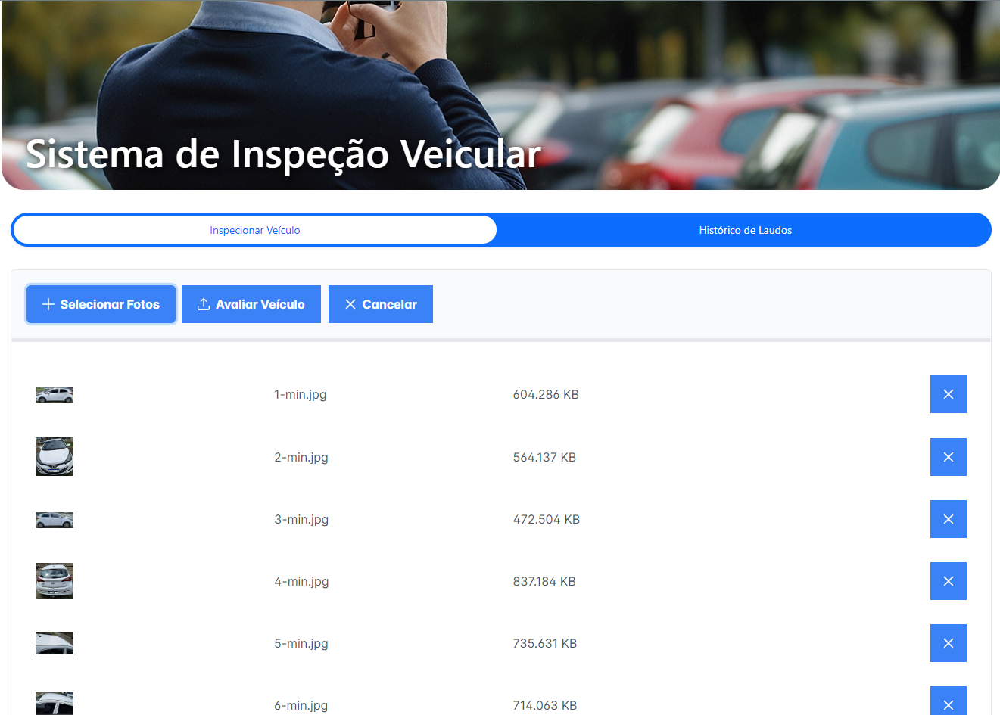
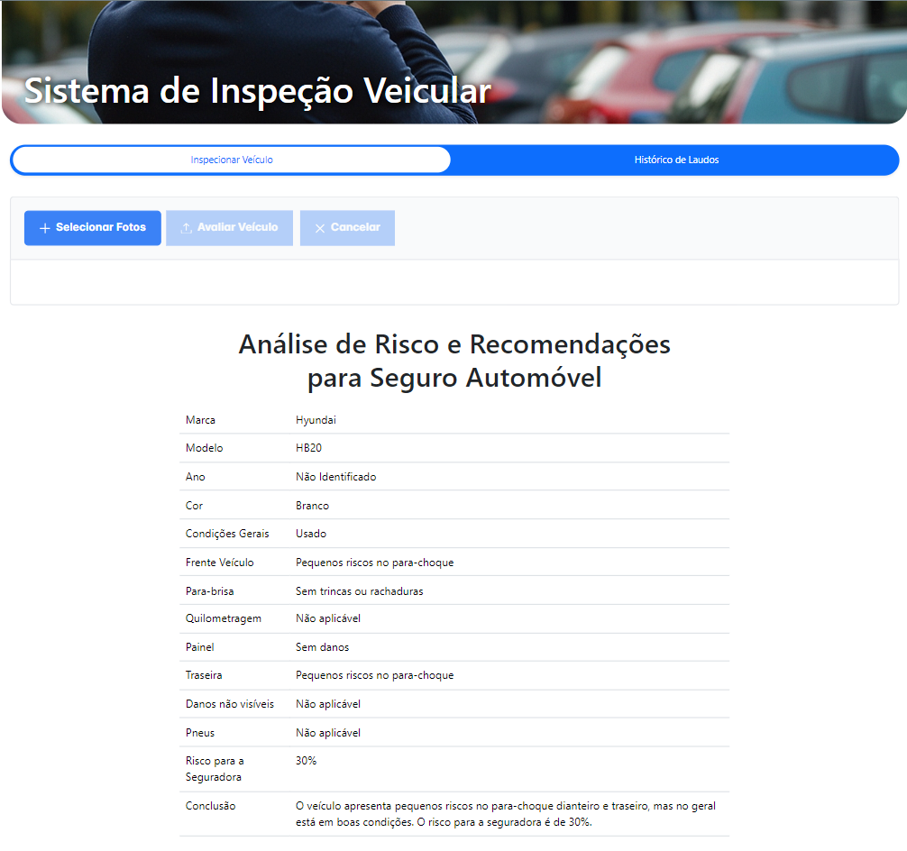

# Car Inspection AI
## Inspeção Veicular Simplificada com Inteligência Artificial

<!-- <iframe width="560" height="315" src="https://youtu.be/7wKHehm4beg" frameborder="0" allowfullscreen></iframe> -->

Car Inspection AI é uma solução para simplificar e agilizar o processo de inspeção veicular para seguradoras. Utilizando a Gemini (tecnologia de Inteligência Artificial da Google), o Car Inspection AI permite uma avaliação detalhada e precisa do estado de um veículo em questão de minutos, fornecendo relatórios completos e confiáveis para avaliação de riscos.

## Como Funciona?
Com o Car Inspection AI, basta tirar algumas fotos do veículo em questão e deixar a inteligência artificial fazer o resto. Nosso algoritmo analisa cada detalhe das imagens, desde a condição geral até os danos não visíveis, e gera um relatório abrangente para auxiliar na tomada de decisão da seguradora.

### Inserindo fotos para análise

### Resultado após análise feita pela IA Google Gemini

## Principais Recursos:
- **Análise Detalhada:** O Car Inspection AI realiza uma análise minuciosa de cada componente do veículo, fornecendo uma visão abrangente do seu estado.
- **Eficiência e Rapidez:** Adeus às inspeções demoradas e trabalhosas. Com o Car Inspection AI, o processo é rápido e eficiente, economizando tempo e recursos para as seguradoras.
- **Precisão Garantida:** Graças à nossa tecnologia, garantimos uma precisão de mais de 90% em nossas avaliações, proporcionando informações confiáveis para avaliação de riscos.
- **Relatórios Customizados:** Os relatórios gerados pelo Car Inspection AI são totalmente personalizáveis, permitindo que as seguradoras priorizem as informações mais relevantes para suas decisões.

## Benefícios para as Seguradoras:
- Redução de Custos Operacionais
- Tomada de Decisão mais Rápida e Confiável
- Melhoria na Precisão das Avaliações de Risco
- Maior Satisfação do Cliente

## Por que escolher o Car Inspection AI?
Nossa equipe desenvolveu uma solução inovadora e confiável para simplificar o processo de inspeção veicular. O Car Inspection AI é a escolha ideal para seguradoras que buscam melhorar sua eficiência operacional e oferecer um serviço de alta qualidade aos seus clientes.

# Configuração do ambiente De Desenvolvimento
Para montar o ambiente de desenvolvimento e testar a solução, siga as seguintes instruções:
- [Car Inspection AI API - Guia de Configuração](car-inspection-ai-api/README.md)
- [Car Inspection AI App - Guia de Configuração](car-inspection-ai-app/README.md)